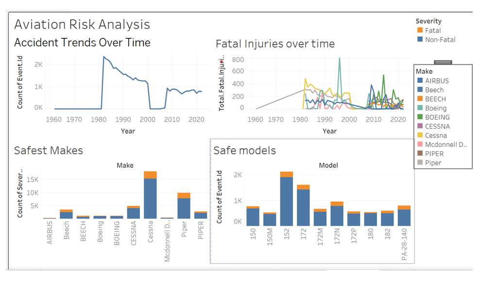

# aviation_risk_analysis
Aviation Risk Analysis
Overview
This project analyzes historical aviation accident data from 1962 to 2023 to help a company entering the aviation industry select low-risk aircraft makes and models.
It uses Python (Pandas) for data analysis and Tableau for visualizations and dashboard.

Business Understanding
Stakeholder
The primary stakeholder is the Head of Business Development looking to invest in commercial and private aircraft.

Key Business Questions
1. What are the trends in aviation accidents over time?

2. Which aircraft makes have the fewest and least severe accidents?

3. Which manufacturers produce the safest aircraft overall?

The goal is to make data-driven recommendations to reduce risk and support safe expansion into aviation.

Data Understanding and Analysis
Source of Data
The data was sourced from the U.S. National Transportation Safety Board (NTSB) and covers civil aviation accidents and incidents from 1962 to 2023.

Description of Data
Key columns include:

event_id: Unique identifier for each accident

event_date: Date of accident

make: Aircraft manufacturer

model: Aircraft model

total_fatal_injuries: Total fatalities in each event

The dataset was cleaned, missing values were handled, and key features such as accident year and fatal accident flags were added.

Visualizations
The following visualizations are included in the Tableau Dashboard, the presentation slides, and the Jupyter notebook:

Accident Trends Over Time
A line chart showing annual aviation accidents from 1962 to 2023.

Fatal Injuries Over Time by Aircraft Make
A multi-line plot of yearly fatalities for major aircraft manufacturers.

Safest Aircraft Makes
A bar chart comparing fatal vs non-fatal accident counts by aircraft make.

Tableau dashboard: https://public.tableau.com/app/profile/ireen.kibaya/viz/AviationRiskAnalysis_17459482033020/Dashboard1?publish=yes